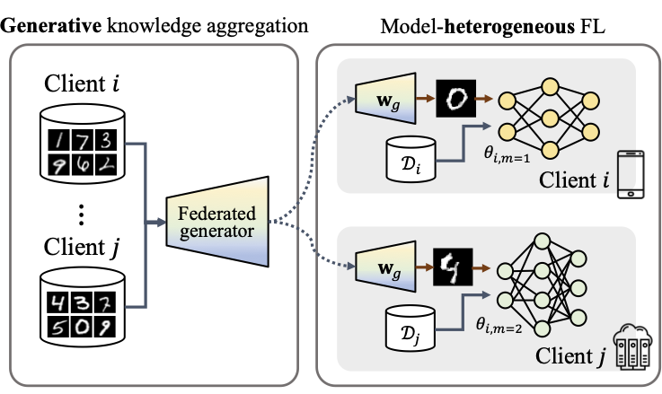
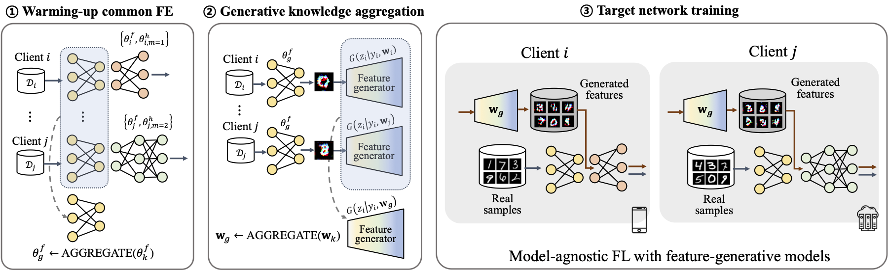

# Heterogeneous-Model Federated Learning

Federated Learning (FL) has emerged as a promising paradigm in distributed learning, aiming to train a single global model while preserving the privacy of individual users. However, the increasing size of recent models introduces challenges of model heterogeneity, encompassing diverse computing capabilities and network bandwidth conditions across clients.

We propose Generative Model-Aided Federated Learning GeFL, which incorporates a conditional generative model trained in a federated manner to aggregate global knowledge under model heterogeneity. Through a series of experiments on various image classification tasks, we demonstrate the discernible performance improvements of GeFL compared to baselines, as well as its limitations in terms of privacy and scalability. To tackle concerns addressed in GeFL, we introduce a novel framework, GeFL-F, feature-generative model-aided FL, by decoupling each target network into a common feature extractor and heterogeneous header. We empirically demonstrate the consistent performance gains of GeFL-F, while proving better privacy preservation and robustness to a large number of clients.






# Examples

## GeFL (DCGAN)
> python GeFL_DCGAN.py --aid_by_gen 1 --num_users 10 --device_id 0 --freeze_gen 0 --gen_model gan 

## GeFL (DCGAN-F)
> python GeFL_DCGAN-F.py --aid_by_gen 1 --num_users 10 --device_id 0 --freeze_gen 0 --gen_model ganf

## GeFL (CVAE)
> python GeFL_CVAE.py --aid_by_gen 1 --num_users 10 --device_id 0 --gen_model vae

## GeFL-F (CVAE-F)
> python GeFL_CVAE-F.py --aid_by_gen 1 --num_users 100 --device_id 0 --name 100cvaef --gen_model vaef

## GeFL-F (DDPM)
> python GeFL_DDPM.py --aid_by_gen 1 --guide_w 0 --num_users 10 --device_id 0 --name 100ddpm  --gen_model ddpm

## GeFL-F (DDPM-F)
> python GeFL_DDPM-F.py --aid_by_gen 1 --guide_w 0 --num_users 10 --device_id 0 --name 100ddpmf  --gen_model ddpmf

## FedAvg
> python GeFL_CVAE.py --aid_by_gen 0 --avg_FE 0

## FedProx
> python GeFL_CVAE.py --aid_by_gen 0 --avg_FE 0 --fedprox 1

## LG-FedAvg
> python GeFL_CVAE.py --aid_by_gen 0 --avg_FE 1

## AvgKD
> python GeFL_CVAE.py --aid_by_gen 0 --avg_FE 0 --avgKD 1


### Citation

Honggu Kang, Seohyeon Cha, and Joonhyuk Kang. {GeFL}: {M}odel-Agnostic Federated Learning with Generative Models. *arXiv preprint arXiv:2412.18460*, 2024.

```
@article{kang2024gefl,
      title={{GeFL}: {M}odel-Agnostic Federated Learning with Generative Models}, 
      author={Honggu Kang and Seohyeon Cha and Joonhyuk Kang},
      year={2024},
      eprint={2412.18460},
      archivePrefix={arXiv},
      primaryClass={cs.LG},
      url={https://arxiv.org/abs/2412.18460}, 
}
```
